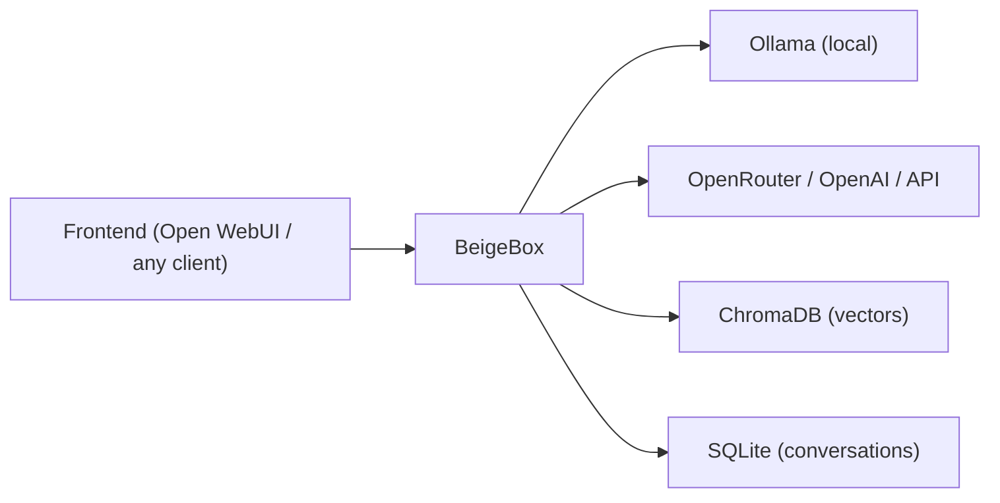

# BeigeBox

Modular, OpenAI-compatible LLM middleware. Sits between your frontend and your model providers — handles routing, orchestration, logging, evaluation, and policy decisions while remaining transparent to both sides.

Tap the line. Control the carrier.



---

## Quick Start

```bash
git clone https://github.com/ralabarge/beigebox.git
cd beigebox/docker
cp env.example .env        # optional — set GPU, ports, API keys
docker compose up -d
```

This brings up four services:

| Service | Port | What it does |
|---|---|---|
| Ollama | `11434` | Local model inference |
| **BeigeBox** | `1337` | Middleware proxy + API + web UI |
| Open WebUI | `3000` | Chat frontend (talks to BeigeBox, not Ollama directly) |
| ChromaDB | — | Vector storage (internal) |

Open **http://localhost:3000** for the chat UI, or **http://localhost:1337** for BeigeBox's built-in web interface.

The OpenAI-compatible API is at `http://localhost:1337/v1` — point any client at it.

### Voice support

```bash
docker compose --profile voice up -d
```

Adds Whisper (STT) and Kokoro (TTS) as sidecars. Enable in the Config tab or `runtime_config.yaml`.

### GPU acceleration

Uncomment the `deploy` block on the `ollama` service in `docker-compose.yaml` and restart.

---

## What you get

Because all LLM traffic passes through BeigeBox, it can observe, route, modify, store, and orchestrate everything without your frontend or backend knowing it exists.

### Routing

Multi-tier routing pipeline that picks the right model per request:

1. **Z-commands** — user overrides inline (`z: complex`, `z: code`, `z: llama3:8b`)
2. **Agentic scorer** — zero-cost keyword pre-filter for tool-heavy queries
3. **Embedding classifier** — fast cosine-distance classification (~50ms) handles clear cases
4. **Decision LLM** — small local model judges borderline cases

Session-sticky routing keeps a conversation on the same model once classified. Multi-backend failover routes through Ollama, OpenRouter, or any OpenAI-compatible endpoint with priority-based fallback.

### Observability

- **Wiretap** — structured JSONL log of every request, response, routing decision, tool call, and timing breakdown
- **Cost tracking** — per-request, per-model, per-day spend for API backends (OpenRouter cost extraction built in)
- **Model performance** — tokens/sec, cache hit rate, latency percentiles from SQLite
- **Flight recorder** — request lifecycle timelines with per-stage timing

### Orchestration

- **Harness** — send the same prompt to N models in parallel, compare results side by side
- **Orchestrated mode** — goal-driven agent loop: plan → dispatch tasks to models/operator → evaluate → iterate
- **Ensemble voting** — parallel responses judged by an LLM arbiter, returns the best with reasoning
- **Operator agent** — JSON tool-loop agent with sandboxed shell, web search, memory recall, calculator, and plugin tools

### Storage

- **SQLite** — every conversation, message, cost, and latency metric persisted locally
- **ChromaDB** — vector embeddings for semantic search and classification
- **Conversation replay** — reconstruct any conversation with full routing context
- **Conversation forking** — branch a conversation into a new thread via `z: fork`

### Hooks & Plugins

- **Pre/post hooks** — Python scripts that intercept requests and responses (prompt injection detection, RAG context injection, synthetic request filtering)
- **Plugin system** — drop a `*Tool` class in `plugins/` and it auto-registers into the tool registry
- **System context injection** — hot-reloaded `system_context.md` prepended to every request

---

## Web UI

BeigeBox includes a built-in single-file web interface at `http://localhost:1337` with eight tabs:

| Tab | What it does |
|---|---|
| **Dashboard** | Storage stats, model performance charts, cost breakdown, backend health |
| **Chat** | Multi-pane streaming chat — fan out to N models simultaneously |
| **Conversations** | Semantic search, replay, fork, export |
| **Flight Recorder** | Request lifecycle timelines with latency breakdown |
| **Tap** | Live wiretap stream with role/direction filters |
| **Operator** | Interactive agent with tool execution |
| **Harness** | Parallel model comparison + orchestrated goal-driven mode + ensemble voting |
| **Config** | Full config editor with hot-reload — every setting, feature flag, and generation parameter |

Optional vi-mode keybindings. Mobile-responsive. No JavaScript dependencies.


---

## CLI

Phreaker-themed commands, each with standard aliases:

```
beigebox dial          Start the proxy server (aliases: start, serve, up)
beigebox tap           Live wiretap stream (aliases: log, tail, watch)
beigebox ring          Ping a running instance (aliases: status, ping, health)
beigebox sweep         Semantic search over conversations (aliases: search, find)
beigebox dump          Export conversations to JSON (aliases: export)
beigebox flash         Stats and config at a glance (aliases: info, config, stats)
beigebox operator      Launch the operator agent (aliases: op)
beigebox setup         Pull required models into Ollama (aliases: install, pull)
beigebox build-centroids  Build embedding classifier centroids
beigebox tone          Print the banner
```

---

## Z-Commands

Prefix any chat message with `z:` to override routing, force tools, or branch conversations:

```
z: simple              Route to the fast model
z: complex             Route to the large model
z: code                Route to the code model
z: llama3:8b           Route to an exact model
z: search              Force web search and inject results
z: memory              Search past conversations for context
z: calc 2^32           Evaluate a math expression
z: sysinfo             Get system resource stats
z: fork                Fork this conversation into a new branch
z: complex,search      Chain multiple directives
z: help                Show all available commands
```

---

## Configuration

Two config files, by design:

- **`config.yaml`** — permanent infrastructure settings (backends, storage paths, model names, security policies). Loaded once at startup.
- **`runtime_config.yaml`** — session overrides (default model, temperature, voice toggle, vi mode). Hot-reloaded on every request via mtime check — no restart needed.

Everything in both files is editable from the web UI Config tab.

### Key feature flags (all disabled by default)

```yaml
decision_llm.enabled: false      # Multi-tier routing pipeline
operator.enabled: false          # LLM-driven tool execution (review allowed_tools first)
auto_summarization.enabled: false # Context window management
cost_tracking.enabled: false     # Per-request spend tracking
backends_enabled: false          # Multi-backend routing with failover
voice.enabled: false             # Push-to-talk STT/TTS
```

---

## Security

- **Operator sandboxing** — disabled by default; when enabled, tool access is restricted via `operator.allowed_tools` config
- **Shell hardening** — Python allowlist → bwrap namespace sandbox → busybox wrapper fallback → audit logging (four layers)
- **Prompt injection hooks** — configurable detection with scoring and blocking
- **Non-root container** — runs as `appuser` (UID 1000)
- **No network in sandbox** — bwrap `--unshare-all` isolates shell commands from the network
- **Blocked patterns** — belt-and-suspenders regex blocking on top of the allowlist

---

## API

OpenAI-compatible endpoints — any client that speaks the OpenAI API works without modification:

```
POST /v1/chat/completions       Chat (streaming and non-streaming)
GET  /v1/models                 List available models
POST /v1/embeddings             Embeddings passthrough
POST /v1/audio/transcriptions   STT (routes to Whisper when voice profile active)
POST /v1/audio/speech           TTS (routes to Kokoro when voice profile active)
```

BeigeBox-specific endpoints:

```
GET  /api/v1/config             Full merged config
POST /api/v1/config             Hot-apply config changes
GET  /api/v1/stats              Storage and usage statistics
GET  /api/v1/costs              Cost breakdown by model/day/conversation
GET  /api/v1/search             Semantic search grouped by conversation
GET  /api/v1/tap                Wiretap log stream
GET  /api/v1/backends           Backend health and status
GET  /api/v1/model-performance  Tokens/sec, latency, cache stats
POST /api/v1/operator           Run the operator agent
POST /api/v1/ensemble           Multi-model ensemble with LLM judge
POST /api/v1/harness/orchestrate  Goal-driven orchestration (SSE stream)
GET  /api/v1/conversation/{id}/replay  Full conversation reconstruction
POST /api/v1/conversation/{id}/fork    Branch a conversation
```

Ollama-native endpoints (`/api/tags`, `/api/chat`, `/api/generate`, etc.) are forwarded transparently. A catch-all route forwards anything not explicitly handled — BeigeBox stays invisible.

---

## Project Structure

```
beigebox/
├── main.py                 FastAPI app — all endpoints
├── proxy.py                Core proxy — routing, streaming, hooks, logging
├── config.py               Config loader with hot-reload
├── cli.py                  CLI entry point
├── costs.py                Cost tracking
├── hooks.py                Pre/post hook manager
├── orchestrator.py         Parallel task orchestrator
├── replay.py               Conversation replay
├── summarizer.py           Auto-summarization
├── system_context.py       System prompt injection
├── wiretap.py              Structured wire logging
├── agents/
│   ├── decision.py         Decision LLM (Tier 4 routing)
│   ├── embedding_classifier.py  Centroid classifier (Tier 3)
│   ├── agentic_scorer.py   Keyword pre-filter (Tier 2)
│   ├── zcommand.py         Z-command parser (Tier 1)
│   ├── operator.py         JSON tool-loop agent
│   ├── harness_orchestrator.py  Goal-driven orchestration
│   └── ensemble_voter.py   Multi-model voting with LLM judge
├── backends/
│   ├── router.py           Multi-backend router with failover
│   ├── ollama.py           Ollama backend
│   ├── openai_compat.py    Generic OpenAI-compatible backend
│   ├── openrouter.py       OpenRouter (with cost extraction)
│   └── retry_wrapper.py    Retry logic with exponential backoff
├── storage/
│   ├── sqlite_store.py     Conversation + metrics persistence
│   ├── vector_store.py     Embedding + semantic search
│   └── backends/           Vector backend abstraction (ChromaDB, extensible)
├── tools/
│   ├── registry.py         Tool dispatch + plugin loading
│   ├── system_info.py      System stats (bwrap sandboxed)
│   ├── memory.py           Conversation recall via vector search
│   ├── calculator.py       Math evaluation
│   ├── datetime_tool.py    Time/date
│   ├── web_search.py       DuckDuckGo search
│   ├── google_search.py    Google Custom Search
│   ├── web_scraper.py      Page content extraction
│   ├── ensemble.py         Ensemble tool for operator
│   ├── notifier.py         Webhook notifications
│   └── plugin_loader.py    Auto-discovery from plugins/
└── web/
    ├── index.html          Single-file web UI (no build step)
    └── vi.js               Optional vi-mode keybindings
```

---

## Requirements

- Docker and Docker Compose (recommended)
- Or: Python 3.11+, Ollama running locally

```bash
pip install -e .
beigebox dial
```

---

## License

AGPL-3.0. See [LICENSE.md](LICENSE.md) for the full text.

Commercial licensing available — reach out for proprietary use cases.
