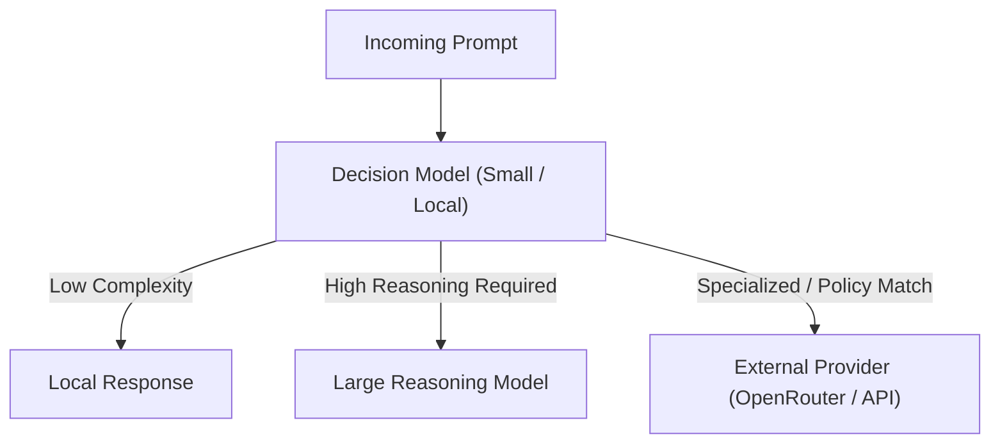
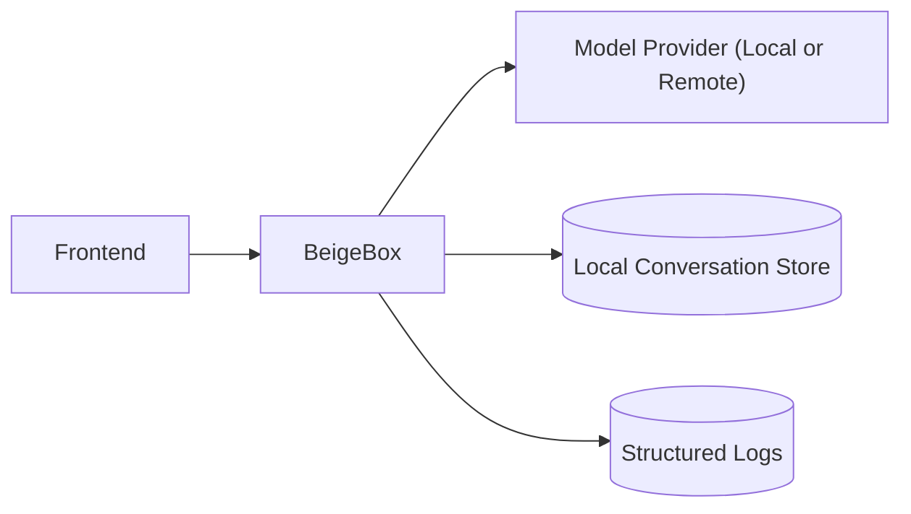

# BeigeBox

BeigeBox is a modular, OpenAI-compatible LLM middleware platform designed to give engineers architectural control over their AI stack.

It sits between your frontend and your model providers, handling routing, orchestration, logging, evaluation, and policy decisions while remaining provider-agnostic and locally reproducible.

It is both:

- A middleware control plane for LLM traffic
- A runnable full-stack environment (API + models + UI) deployable via Docker Compose

---

## Quick Start

BeigeBox runs as a multi-service stack using Docker Compose.

```bash
git clone https://github.com/ralabarge/beigebox.git
cd beigebox/docker
docker compose up -d
```

By default this brings up:

- BeigeBox middleware (FastAPI)
- Local model runtime (e.g., Ollama)
- Vector store (e.g., ChromaDB)
- Frontend (e.g., Open WebUI)

Access the OpenAI-compatible API:

```
http://localhost:8000/v1
```

Connect any OpenAI-compatible frontend to BeigeBox instead of directly to your model provider.

Minimal configuration. Fully extensible.

---

## Architecture Overview

```mermaid
flowchart LR
  FE[Frontend (Open WebUI / Custom Client)]
  BB[BeigeBox Middleware Control Plane]
  LM[Local Models (Ollama / GGUF)]
  EP[External Providers (OpenAI / OpenRouter / API)]
  VS[Vector Store (ChromaDB)]

  FE --> BB
  BB --> LM
  BB --> EP
  BB --> VS
```

---

## Decision-Layer Routing (LLM Controlling LLMs)



---

## Conversation Persistence & Observability



---

## What BeigeBox Does

Because all traffic passes through the middleware layer, BeigeBox can:

- Route requests to different providers
- Inject policy or augmentation logic
- Log and replay conversations
- Apply classification or gating logic
- Perform evaluation workflows
- Maintain persistent local history

It does not replace your frontend.  
It does not replace your models.  
It controls the interaction layer between them.

---

## Model Providers

BeigeBox is OpenAI-compatible and provider-agnostic.

Supported backends include:

- Local runtimes (e.g., Ollama, GGUF models)
- OpenAI-compatible APIs
- OpenRouter
- Other OpenAI-spec compatible endpoints

Routing policies can be defined to:

- Keep tasks local
- Escalate to larger remote models
- Select models based on cost or capability
- Delegate selectively based on classification

---

## AI Harnessing & Orchestration

BeigeBox supports structured orchestration patterns:

- Multi-model comparison
- Ensemble voting
- Response arbitration
- Small-model gating
- Evaluation and scoring loops
- Tool-call mediation

This enables an architectural pattern where one LLM can control other LLMs — evaluating, filtering, escalating, or aggregating outputs based on defined policy.

LLMs become components in a controlled system, not isolated endpoints.

---

## Conversation History & Local Control

A core design goal is durable local control of conversation history.

Regardless of:

- Which frontend you use
- Which provider you route to
- Whether requests are local or remote

All structured request and response data can be persisted locally.

This enables:

- Complete conversation continuity
- Replay and debugging
- Provider switching without data loss
- Independence from frontend storage models

Your conversation history remains in your infrastructure.

---

## Embeddings & Context Control

BeigeBox integrates embedding workflows to support:

- Semantic classification
- Context gating
- Vector storage (e.g., ChromaDB)
- Controlled context injection

This enables classification-driven routing and persistent semantic memory without surrendering architectural control.

---

## Observability

BeigeBox provides structured logging of:

- Prompts
- Routing decisions
- Model outputs
- Timing data
- Tool invocations

Built for inspection, debugging, and iteration.

---

## Design Goals

- Local-first operation
- Provider-agnostic routing
- Explicit orchestration logic
- Persistent local conversation history
- Modular agent abstraction
- Reproducible infrastructure

BeigeBox is infrastructure for controlling how LLMs behave inside your system.
